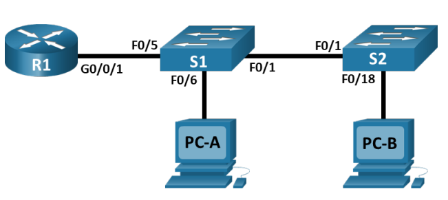

# Внедрение маршрутизации между виртуальными локальными сетями
## Задачи
1. **Создание сети и настройка основных параметров устройства**
2. **Создание сетей VLAN и назначение портов коммутатора**
3. **Настройка транка 802.1Q между коммутаторами**
4. **Настройка маршрутизации между сетями VLAN**
5. **Проверка, что маршрутизация между VLAN работает**
## Топология

## Таблица адрессации
Устройство | Интерфейс | IP-адрес | Маска подсети | Шлюз по умолчанию
--- | --- | --- | --- | ---
R1 | G0/0/1.3 | 192.168.3.1 | 255.255.255.0 | -
R1 | G0/0/1.4 | 192.168.4.1 | 255.255.255.0 | -
R1 | G0/0/1.8 | - | - | - 
S1 | VLAN 3 | 192.168.3.11 | 255.255.255.0 | 192.168.3.1
S2 | VLAN 3 | 192.168.3.12 | 255.255.255.0 | 192.168.3.1
PC-A | NIC | 192.168.3.3 | 255.255.255.0 | 192.168.3.1
PC-A | NIC | 192.168.4.3 | 255.255.255.0 | 192.168.4.1

## Таблица VLAN
VLAN | Имя | Назначенный интерфейс
--- | --- | ---
3 | Управление | *S1: VLAN 3*; **S2: VLAN 3** S1: F0/6
4 | Operations | S2: F0/18
7 | Parking_Lot | *S1: F0/2-4, F0/7-24, G0/1-2*; **S2: F0/2-17, F0/19-24, G0/1-2**
8 | Native |